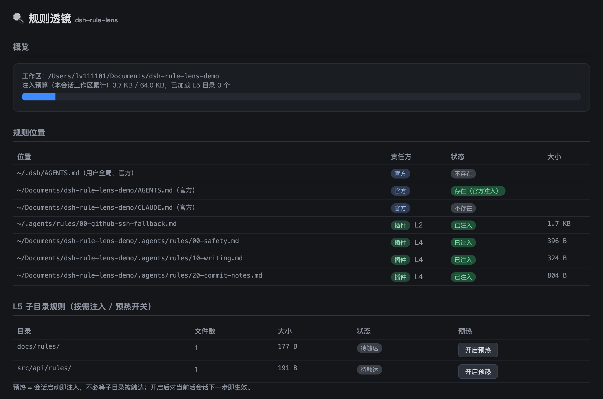

# dsh-rule-lens · 规则透镜

> **RuleScope 家族内核插件** · Every rule, in scope. · 让每条规则看得见、管得住、可审计



DeepSeek Harness（dsh 0.1.0-rc.6）本地插件：把分散在各层的规则文件**看得清、管得住、可审计**。

- **分层规则发现与注入**：`~/.agents/AGENTS.md`、`~/.agents/rules/`、`<工作区>/.agents/rules/` 启动即注入；`<子目录>/rules/` 在该目录第一次被 read/write/edit 触达后按需注入（每目录每会话一次）。
- **写回防护**：拦截对工作区内既有 `.md` 文件的全文覆写，引导模型改用 `edit` 定向修改。
- **FORBID 硬规则**：规则文件里写 `FORBID: <工具glob> <路径glob>`（如 `FORBID: write *.env`）即成为硬拦截。
- **规则 Lint**：超长 / 无禁令词 / 像教程 / 内容重复，四项体检。
- **注入日志 + 遵守率**：`~/.dsh/rule-lens/log.jsonl` 与 `compliance.jsonl`，面板可导出。
- **面板**：web profile 下访问 `http://127.0.0.1:3080/rule-lens`。

零构建、纯 ESM、零运行时三方依赖（仅 `@deepseek-ai/*` peer 与 Node 内置模块）。

## 目录结构与责任边界

| 层 | 位置 | 责任方 | 生效时机 |
|---|---|---|---|
| 官方 | `~/.dsh/AGENTS.md`、`<库根>/AGENTS.md`、`<子目录>/AGENTS.md` | dsh-agent-instructions | 官方机制（本插件只读取状态用于面板展示，不重复注入） |
| L1 | `~/.agents/AGENTS.md` | 插件 | 会话启动 |
| L2 | `~/.agents/rules/*.md` | 插件 | 会话启动 |
| 白名单 | `~/.cursor/rules/*`、`<工作区>/.cursor/rules/*`（以配置为准） | 插件 | 会话启动 |
| L4 | `<工作区>/.agents/rules/*.md` | 插件 | 会话启动 |
| L5 | `<子目录>/rules/*.md` | 插件 | 子目录首次被触达后 / 预热开启时启动注入 |

- 多文件按数字前缀排序（`00-*.md` 先于 `01-*.md`）；窄覆盖宽，注入顺序 L1→L2→L4→L5。
- 预算默认 64KB：超限时从作用域最宽的文件开始淘汰（L1 先淘汰），淘汰会写日志并在面板告警（不静默丢弃）。

## 安装（本地开发挂载）

```bash
cd dsh-rule-lens
npm install          # 安装 @deepseek-ai/* devDependencies，link 挂载时供 Node 解析 peer

# 挂载到 web profile（pnpm link 协议）
dsh plugin --profile web add link:"$PWD"

# 验证行已注入配置树
dsh --profile web --dump-config | grep -A3 rule-lens
```

之后正常启动 `dsh --profile web`（或 `dsh web`），打开面板 `http://127.0.0.1:3080/rule-lens`。

也可以用 overlay 方式临时挂载（`--patch` 时插件路径必须绝对路径）：

```yaml
# /abs/path/to/overlay.patch.yml
- insert:
    - id: rule-lens
      name: 'link:///abs/path/to/dsh-rule-lens'
```

```bash
dsh --profile web --patch /abs/path/to/overlay.patch.yml
```

## 配置

权威存储双轨（详见 `lib/store.js` 头部注释）：

- **全局开关** → `~/.dsh/settings.yaml` 的 `rule-lens` 节（面板或手改 YAML 均可）：
  ```yaml
  rule-lens:
    writeGuard: true        # 写回防护开关
    budgetBytes: 65536      # 注入预算（字节）
    whitelistDirs: ['.cursor']  # 白名单目录
  ```
- **工作区状态**（L5 预热目录列表）→ `~/.dsh/rule-lens.json`。

两类配置重启自动读取。

## FORBID 硬规则写法

在任何被加载的规则文件（含官方 `AGENTS.md`）里写一行：

```
FORBID: write *.env
FORBID: * **/secrets/**
FORBID: bash *rm -rf*
```

- 工具名 glob 匹配 `exec.name`（`write`、`bash`、`run_code`…）
- 路径 glob 同时匹配：原始参数、解析后的绝对路径、工作区相对路径、`~` 折叠路径
- `*` 不跨 `/`，`**` 跨 `/`；路径写 `*` 表示该工具一律禁止

## 文件说明

```
lib/index.js   宿主入口 apply(ctx)：通道接线、会话状态、settings 双轨、面板挂载
lib/rules.js   发现 / 分层 / 数字前缀排序 / 64KB 预算淘汰 / system-reminder 拼接
lib/guard.js   写回防护 + FORBID 硬规则（tools/pre-execute，prepend 首位）
lib/lint.js    规则 Lint 四项检查
lib/log.js     log.jsonl / compliance.jsonl 追加与尾部读取
lib/store.js   rule-lens.json（按工作区的预热目录列表）
lib/panel.js   /rule-lens 面板页与 JSON API
```

## 手动测试清单

1. `echo "FORBID: write *.env" > ~/.agents/rules/00-test.md`，开会话让模型写 `.env` → 应被 deny
2. 让模型 `write` 一个已存在的 `.md` → 应被 deny 且理由以「若确实需要全文重写，请先向用户说明理由并取得同意」结尾
3. `mkdir -p src/foo/rules && echo "不要用 var" > src/foo/rules/00-style.md`，让模型读 `src/foo/x.js` → 下一步应看到 L5 注入
4. 面板 `/rule-lens`：各层状态、预算条、Lint、遵守率、预热开关、日志下载逐项点一遍
